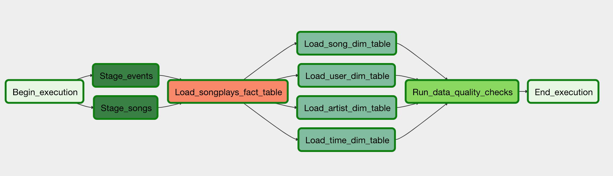

# Airflow - Data Pipelines

## Description

This project was built to create managed Airflow DAG. The pipeline  is responsible for load data from a S3 bucket to a Redshift cluster. First the data is loaded to a staging table, then it is created a fact table. After this, using the fact table the dimension tables are then build. After it is done the generated data is checked for quality.

Logs:
* s3://udacity-dend/log_data
* s3://udacity-dend/song_data

Tables:
* staging_events
* staging_songs

* songplays - Fact table: songplay_id, start_time, user_id, level, song_id, artist_id, session_id, location, user_agent
* users - Dimensional table: user_id, first_name, last_name, gender, level
* songs - Dimensional table: song_id, title, artist_id, year, duration
* artists - Dimensional table: artist_id, name, location, lattitude, longitude
* time - Dimensional table: start_time, hour, day, week, month, year, weekday

## How To Run

1 - Install the requirements
```
pip install requirements.txt
```

2 - Configure dwh.cfg
  Some of the configurations are already fulfiled with recommended settings. The other ones must be completed with yours information.
```
[AWS]
KEY=
SECRET=
REGION=

[DWH]
DWH_CLUSTER_TYPE=multi-node
DWH_NUM_NODES=4
DWH_NODE_TYPE=dc2.large
DWH_CLUSTER_IDENTIFIER=dwhCluster
DWH_DB=dwh
DWH_DB_USER=dwhuser
DWH_DB_PASSWORD=Passw0rd
DWH_PORT=5439
DWH_IAM_ROLE_NAME=dwhRole
```

3 - Create the IAM Role and the cluster
```
python3 app.py
```
  This command will start a CLI that will help you configuring your architeture.
  First create the IAM role (option 1)
  Then create the cluster (option 2). It may take a while and your cursor will be locked until the cluster is avalable. A verification will be made after 30 seconds.
  You can check your cluster status using the option 3.
  Open your TCP connection with option 4.
  Test your connection with option 5.

4 - Create the tables
  Option 6 will create the tables in the Redshift cluster.
  Option 7 can be used to check if the tables were created successfully.

5 - Insert the connections
    At Airflow create a new connection to aws:
      * Conn Id: aws_credentials.
      * Conn Type: Amazon Web Services.
      * Login: Enter your Access key ID from the IAM User credentials.
      * Password: Enter your Secret access key from the IAM User credentials.

    At Airflow create a new connection to redshift:
      * Conn Id: redshift.
      * Conn Type: Postgres.
      * Host: Enter the endpoint of your Redshift cluster, excluding the port at the end.
      * Schema: Enter the value of DWH_DB in your dwh.cfg
      * Login: Enter the value of DWH_DB_USER in your dwh.cfg
      * Password: Enter the value of DWH_DB_PASSWORD in your dwh.cfg
      * Port: Enter the value of DWH_PORT in your dwh.cfg

6 - Initialize airflow using docker-compose:
```
docker-compose up
```

7 - Run the DAG
At Airflow run the DAG udac_example_dag.py.

8 - Delete IAM Role and redshift cluster
    Get back or restart the CLI with "python3 app.py" and select option 8 and then option 9.

## Files description
* app.py - CLI to create and delete our aws infrastructure. The CLI can automatically calls new_IAM_role.py, new_Redshift_Cluster.py and redshift_cluster_actions.py
* new_IAM_role.py - Script create our IAM Role
* new_Redshift_Cluster.py - Script to create the cluster.
* redshift_cluster_actions.py - Auxiliar script to manipulate our cluster
* create_tables.py - Script to create the tables on our Redshift cluster
* dags/udac_example_dag.py: Our main DAG
* plugins/helpers/sql_queries.py: SQL queries to insert data into fact and dimension tables
* plugins/operators/stage_redshift.py: Load data from S3 buckets into staging tables
* plugins/operators/load_fact.py: Loads data from redshift staging tables into fact tables
* plugins/operators/load_dimension.py: Loads data from redshift staging tables into dimension tables
* plugins/operators/data_quality.py: Check the data quality

## DAG Specifications

### Task dependencies



### Task default arguments
* E-mail is not sent on failure or retry
* Catchup is set to False
* The retry delay is five minutes
* The maximun amount of retries is three
* It does not deppends on previous tasks

## Extra
Airflow Exercises of Udacity's Data Engineering Nanodegree can be found at exercises folder.
